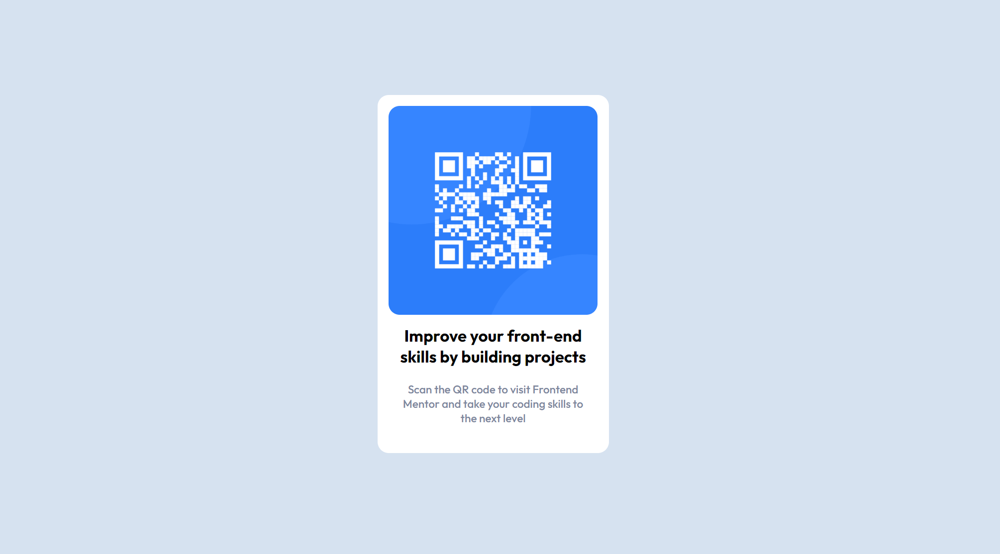

# Frontend Mentor - QR code component solution

This is a solution to the [QR code component challenge on Frontend Mentor](https://www.frontendmentor.io/challenges/qr-code-component-iux_sIO_H). Frontend Mentor challenges help you improve your coding skills by building realistic projects. 

## Table of contents

- [Overview](#overview)
  - [Screenshot](#screenshot)
  - [Links](#links)
- [My process](#my-process)
  - [Built with](#built-with)
  - [What I learned](#what-i-learned)
- [Author](#author)

## Overview
 For the QR code component challenge on Frontend Mentor, I created a responsive QR code component using HTML and CSS. The goal was to build a realistic project to improve my coding skills.
### Screenshot

### Links

- Live Site URL: [Click here](https://neel-07.github.io/QR-code-component/)

## My process
   I began by structuring the HTML to create the QR code and its surrounding elements. This involved using semantic HTML to ensure accessibility and good structure. Then, I moved on to styling the component using CSS. I focused on making the QR code responsive and ensuring it looked visually appealing on different screen sizes.

### Built with

- HTML5
- CSS 

### What I learned
 During this challenge, I gained experience in creating a custom component from scratch using HTML and CSS. I also improved my understanding of responsive design principles and accessibility best practices. This project allowed me to enhance my skills in creating visually appealing and functional components for web development.

## Author

- Github - [Neel Mishra](https://github.com/Neel-07)
- Frontend Mentor - [@Neel-07](https://www.frontendmentor.io/profile/Neel-07)
- Twitter - [Neel](https://twitter.com/NeelMis35789692)

